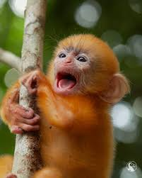
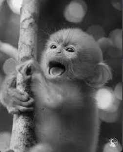
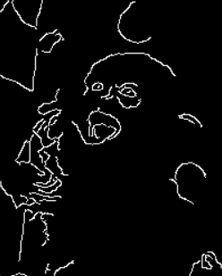

# Image Editor using OpenCV

## Description

A simple menu-driven Image Editor developed using Python and OpenCV. This project allows users to perform basic image processing operations such as grayscale conversion, image resizing, blurring, edge detection, and saving the edited image.

## Features

- Convert image to Grayscale
- Resize image
- Apply Gaussian Blur
- Perform Edge Detection using Canny
- Save processed image
- Menu-driven interface

## Technologies Used

- Python
- OpenCV

## Screenshots

### Original Image



### Grayscale Image



### Blurred Image


### Edge Detection



## How to Run

1. Install Python
2. Install OpenCV

```bash
pip install opencv-python
```

3. Run the program

```bash
python image_editor.py
```

## Project Structure

```text
image-editor-opencv
│
├── image_editor.py
├── monkey.jpeg
├── grayscaled.png
├── blurred.png
├── edge_detected.png
└── README.md
```

## Author

Fasna Shabeer
